<div align="center">

<a href="https://git.io/typing-svg"></a>

<br>


</div>

---

<div align="center">
<a href="https://git.io/typing-svg"></a>
</div>

| Component | Name |
|---|---|
| **OS** | Arch Linux |
| **WM** | Hyprland |
| **Terminal** | Ghostty |
| **Shell** | ZSH (Powerlevel10k + Zinit) |
| **Editor** | Neovim |
| **File Manager** | Yazi |
| **Browser** | Brave |
| **Bar** | Waybar |
| **Launcher** | Rofi |
| **Notifications** | SwayNC |
| **Lockscreen** | Quickshell (nierlock) |
| **Logout** | wlogout |
| **Fetch** | Fastfetch |
| **Audio Visualizer** | Cava |
| **Startpage** | Custom (HTML/CSS/JS) |
| **GRUB Theme** | [double-minegrub-menu](https://github.com/Lxtharia/double-minegrub-menu) |
| **Dotfiles Manager** | chezmoi |

---

<div align="center">
<a href="https://git.io/typing-svg"></a>
</div>

Les wallpapers sont dans `~/Pictures/Wallpapers/` et gérés par chezmoi.
**Pywal** génère automatiquement les couleurs du terminal, waybar et rofi en fonction du wallpaper actif.

<div align="center">

| Lockscreen (Hyprlock) | Fastfetch Logo |
|---|---|
|  | 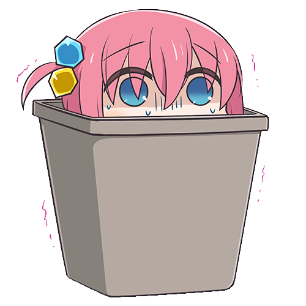 |
| Wallpaper affiché sur l'écran de verrouillage | Logo affiché dans le terminal avec Fastfetch |

</div>

### 🎭 Logos Fastfetch

Fastfetch affiche un **logo aléatoire** à chaque ouverture du terminal. Les logos sont dans `~/.config/fastfetch/logos/` :

<div align="center">

| | | | |
|---|---|---|---|
|  |  |  |  |
|  | 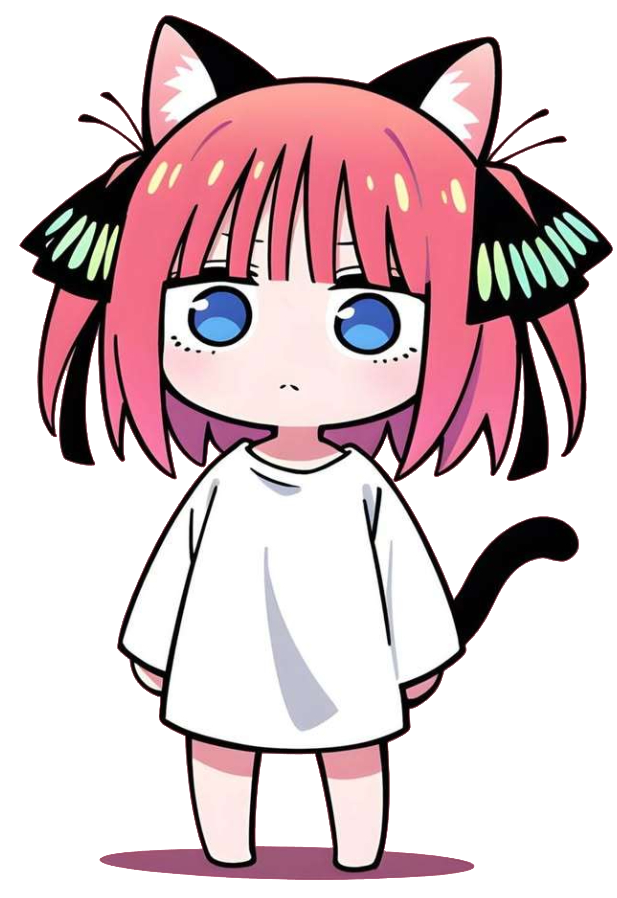 |  |  |
|  |  |  |  |
|  |  |  | 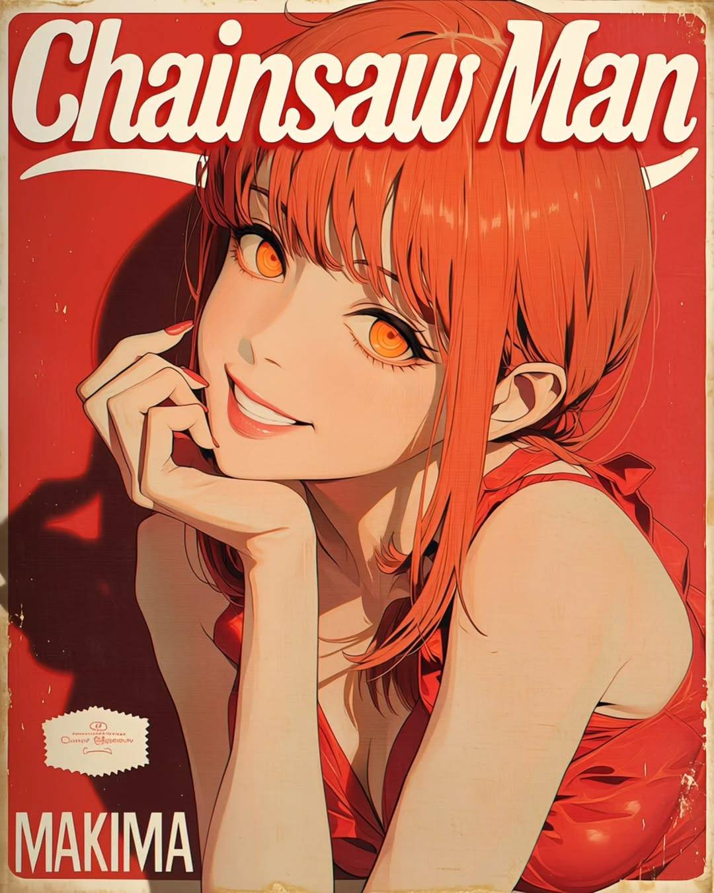 |
| 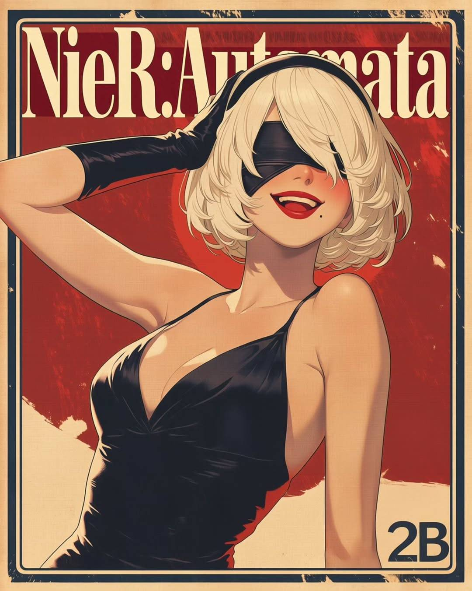 | 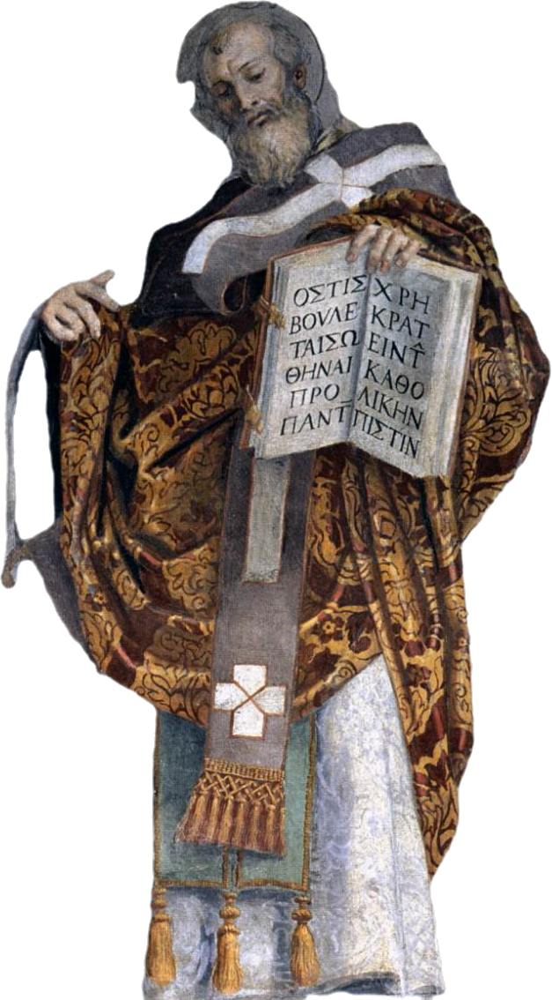 | | |

</div>

### 🌄 Wallpapers collection

<div align="center">

| | | |
|---|---|---|
|  |  | 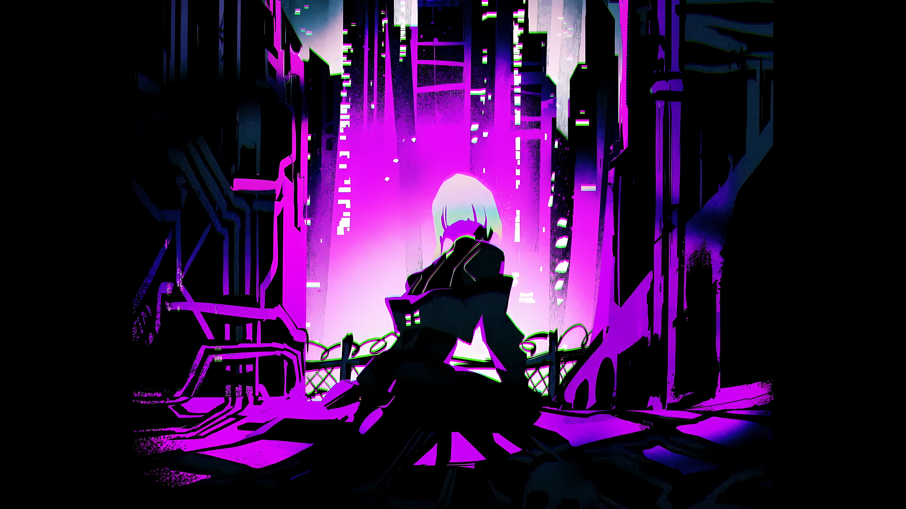 |
|  |  | 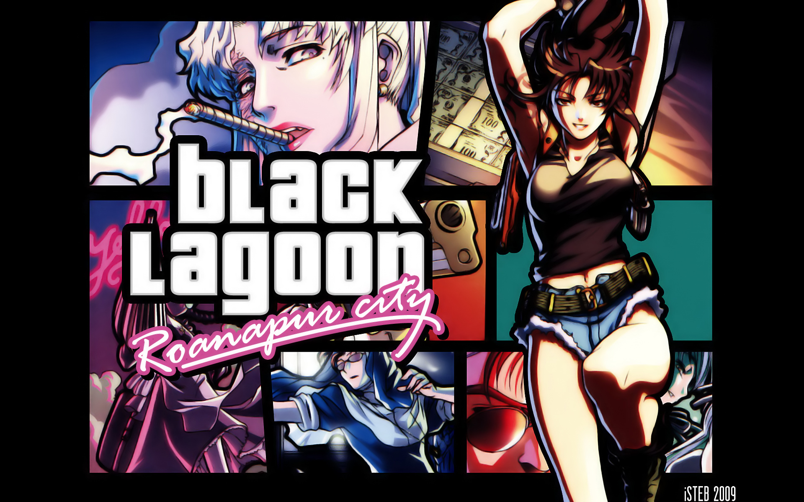 |
| 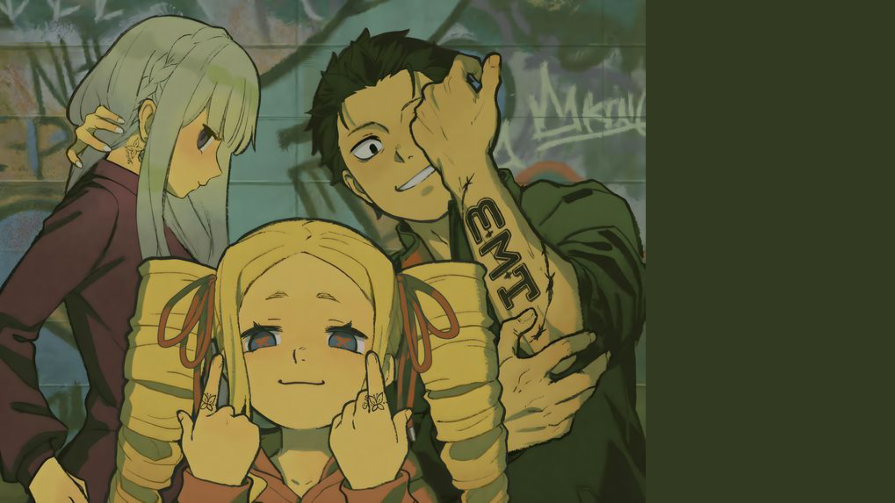 |  |  |
|  | 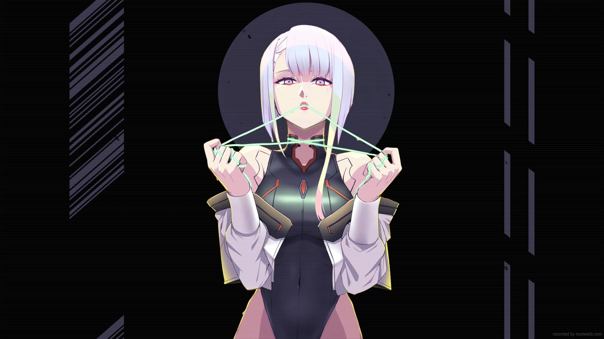 |  |
|  | 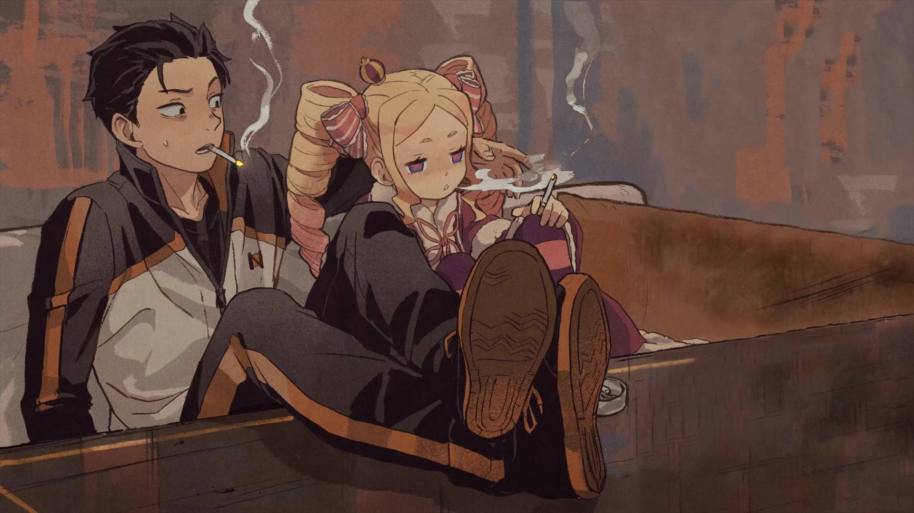 | 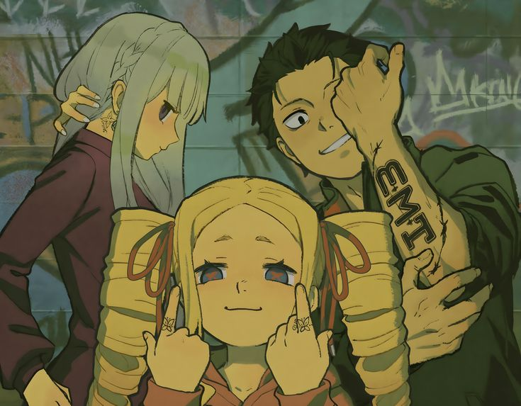 |
| 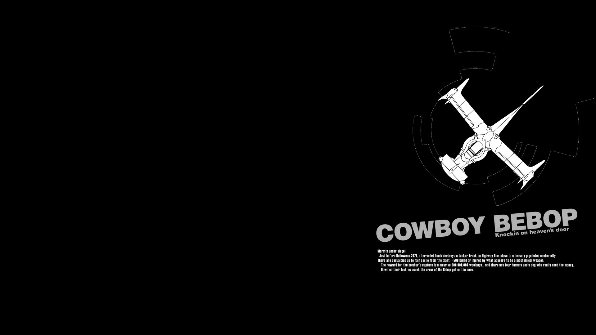 |  | 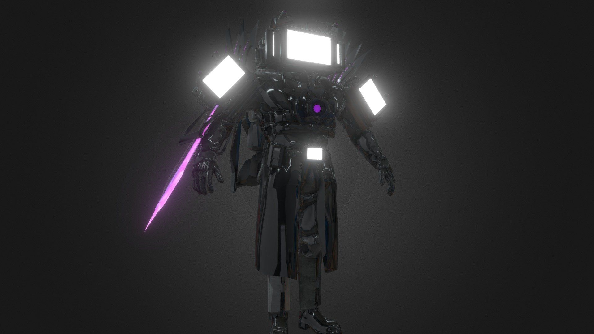 |
|  | | |

</div>

---

<div align="center">
<a href="https://git.io/typing-svg"></a>
</div>

<div align="center">

| Terminal (Ghostty + Fastfetch) |
|---|
| 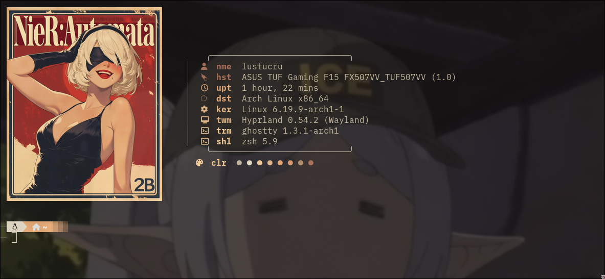 |
| Ghostty avec Fastfetch, Powerlevel10k, Pywal et logo aléatoire |

| Rofi (App Launcher) |
|---|
| 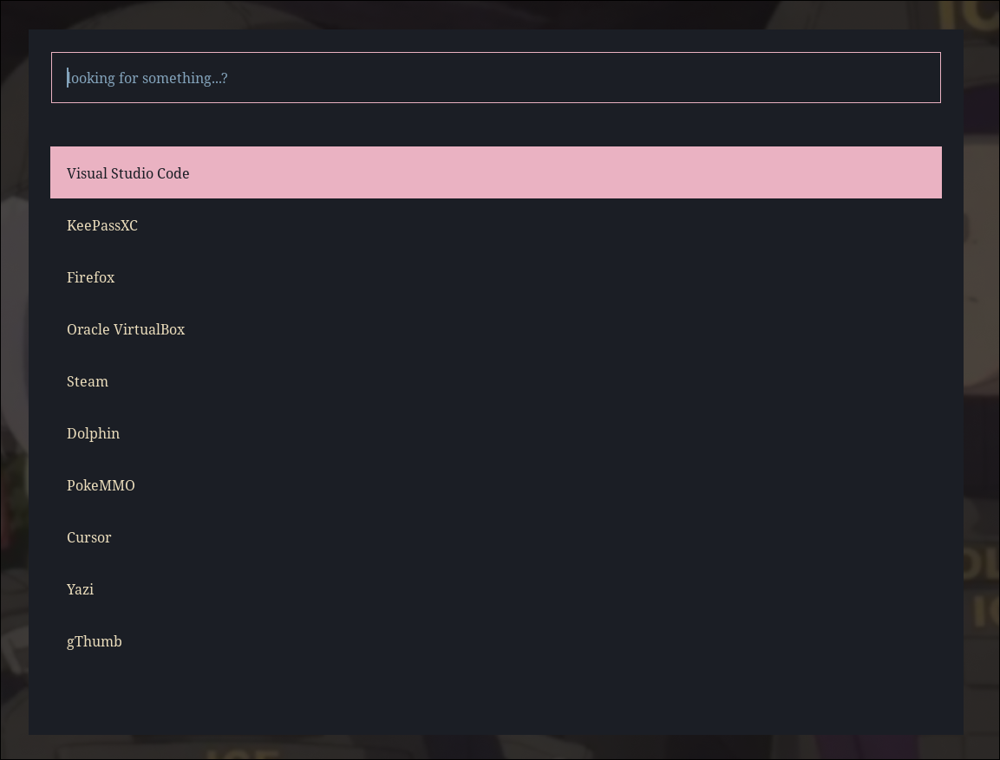 |
| Lanceur d'applications avec thème Pywal dynamique |

| Startpage |
|---|
| 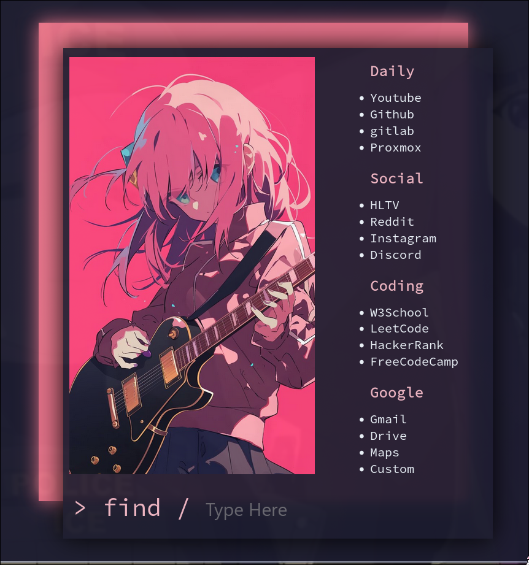 |
| Page d'accueil du navigateur avec liens rapides |

</div>

---

<div align="center">
<a href="https://git.io/typing-svg"></a>
</div>

La startpage est une page d'accueil custom pour le navigateur, avec des raccourcis vers les sites fréquemment utilisés.

- **Thèmes multiples** : blue, cherry, violet, green, mesh-purple, orange
- **Liens rapides** configurables
- **Design responsive** avec Source Code Pro

La config se trouve dans `~/.config/startpage/` et utilise du HTML/CSS/JS pur.

---

<div align="center">
<a href="https://git.io/typing-svg"></a>
</div>

Le bootloader utilise [**double-minegrub-menu**](https://github.com/Lxtharia/double-minegrub-menu), un thème GRUB inspiré du menu Minecraft.

- **Style Minecraft** pour la sélection du système au démarrage
- **Animation** du menu titre
- **Sélection stylisée** des entrées de boot

Installation :

```bash
git clone https://github.com/Lxtharia/double-minegrub-menu.git
cd double-minegrub-menu
sudo cp -r minegrub-double-theme /boot/grub/themes/
```

Puis dans `/etc/default/grub` :
```bash
GRUB_THEME="/boot/grub/themes/minegrub-double-theme/theme.txt"
```

```bash
sudo grub-mkconfig -o /boot/grub/grub.cfg
```

---

<div align="center">
<a href="https://git.io/typing-svg"></a>
</div>

<details>
<summary><b>🪟 Window Manager & Desktop</b></summary>

- **Hyprland** — config, keybindings, animations, windowrules, workspaces
- **Waybar** — bar avec themes, scripts, modules custom
- **Rofi** — launcher, clipboard, wallpaper selector, themes
- **SwayNC** — notifications
- **wlogout** — logout menu avec icônes custom
- **Quickshell** — nierlock (lockscreen)

</details>

<details>
<summary><b>🖥️ Terminal & Shell</b></summary>

- **Ghostty** — config + theme catppuccin
- **Kitty** — config + themes
- **ZSH** — Powerlevel10k, zinit, fzf, zoxide, pywal, aliases
- **Fish** — config de base
- **Tmux** — config + plugins (TPM)

</details>

<details>
<summary><b>✏️ Editor</b></summary>

- **Neovim** — config complète avec :
  - LSP, autocompletion (blink)
  - Telescope (fuzzy finder)
  - NeoTree (file explorer)
  - Treesitter (syntax highlighting)
  - Catppuccin theme
  - Lualine, gitsigns, mini.nvim
  - Toggleterm, formatting, comments

</details>

<details>
<summary><b>🎨 Theming & Visuals</b></summary>

- **Pywal** — couleurs dynamiques depuis le wallpaper
- **GTK 3 & 4** — settings
- **Fontconfig** — configuration des polices
- **Colors** — palette partagée (CSS + Rasi)
- **Fastfetch** — logos custom (bocchi, UwU, makima...)
- **Wallpapers** — 50+ wallpapers inclus

</details>

<details>
<summary><b>🔧 Outils</b></summary>

- **Yazi** — file manager terminal
- **btop** — monitoring système + themes
- **cava** — visualiseur audio
- **mpv** — lecteur vidéo
- **htop** — process viewer
- **viegphunt scripts** — wallpaper, launcher, clipboard, keybinds

</details>

<details>
<summary><b>🌐 Startpage & Boot</b></summary>

- **Startpage** — page d'accueil navigateur (HTML/CSS/JS, multi-thèmes)
- **GRUB** — thème Minecraft ([double-minegrub-menu](https://github.com/Lxtharia/double-minegrub-menu))

</details>

---

<div align="center">
<a href="https://git.io/typing-svg"></a>
</div>

```
~/.local/share/chezmoi/          # Dépôt source chezmoi
│
├── dot_zshrc                    # Config ZSH (aliases, plugins, pywal, fzf)
├── dot_bashrc                   # Config Bash
├── dot_profile                  # Variables d'environnement
├── dot_gitconfig                # Config Git
├── dot_p10k.zsh                 # Thème Powerlevel10k
├── dot_tmux.conf                # Config Tmux
├── dot_gdbinit                  # Config GDB
├── dot_condarc                  # Config Conda
│
├── dot_config/
│   │
│   ├── hypr/                    # 🪟 HYPRLAND — Window Manager
│   │   ├── hyprland.conf        #    Config principale (source les fichiers de conf/)
│   │   ├── hyprlock.conf        #    Écran de verrouillage (wallpaper + style)
│   │   ├── conf/
│   │   │   ├── keybinding.conf  #    ⌨️  Tous les raccourcis clavier
│   │   │   ├── autostart.conf   #    🚀 Apps lancées au démarrage
│   │   │   ├── appearance.conf  #    🎨 Bordures, gaps, couleurs
│   │   │   ├── animation.conf   #    ✨ Animations des fenêtres
│   │   │   ├── monitors.conf    #    🖥️  Config des écrans
│   │   │   ├── windowrule.conf  #    📏 Règles par fenêtre
│   │   │   ├── workspaces.conf  #    📑 Config des workspaces
│   │   │   ├── input.conf       #    🖱️  Clavier, souris, touchpad
│   │   │   ├── layout.conf      #    📐 Layout (dwindle)
│   │   │   ├── misc.conf        #    ⚙️  Options diverses
│   │   │   ├── environment.conf #    🌍 Variables d'environnement
│   │   │   └── programs.conf    #    📦 Terminal, browser, file manager
│   │   └── scripts/
│   │       ├── volume_control.sh#    🔊 Contrôle du volume
│   │       └── wlogout.sh       #    🚪 Script de logout
│   │
│   ├── waybar/                  # 📊 WAYBAR — Barre de statut
│   │   ├── config.jsonc         #    Config principale (modules, position)
│   │   ├── style.css            #    Style CSS de la barre
│   │   ├── modules              #    Définition des modules
│   │   ├── themes/              #    🎨 Thèmes (Catppuccin, Tokyo Night, etc.)
│   │   ├── colors/              #    🌈 Palettes de couleurs
│   │   └── scripts/             #    📜 Scripts (météo, mediaplayer)
│   │
│   ├── nvim/                    # ✏️  NEOVIM — Éditeur de code
│   │   ├── init.lua             #    Point d'entrée (charge lazy.nvim)
│   │   ├── lazy-lock.json       #    Versions lockées des plugins
│   │   └── lua/
│   │       ├── keymaps.lua      #    ⌨️  Raccourcis custom
│   │       ├── options.lua      #    ⚙️  Options (numéros, tabs, etc.)
│   │       └── plugins/
│   │           ├── telescope.lua    # 🔍 Fuzzy finder
│   │           ├── neo-tree.lua     # 📂 Explorateur de fichiers
│   │           ├── treesitter.lua   # 🌳 Syntax highlighting
│   │           ├── lsp-config.lua   # 🧠 Language Server Protocol
│   │           ├── autocomplete.lua # 💬 Autocomplétion
│   │           ├── catppuccin.lua   # 🎨 Thème
│   │           ├── lualine.lua      # 📊 Status line
│   │           ├── gitsigns.lua     # 📝 Git dans le gutter
│   │           ├── toggleterm.lua   # 🖥️  Terminal intégré
│   │           ├── formatting.lua   # ✨ Auto-formatage
│   │           ├── mini-nvim.lua    # 🔧 Mini plugins (comments, etc.)
│   │           ├── dashboard.lua    # 🏠 Écran d'accueil
│   │           ├── colorizer.lua    # 🎨 Preview des couleurs
│   │           ├── snacks-nvim.lua  # 🍿 Notifications & utilitaires
│   │           ├── rainbow-delimiters.lua  # 🌈 Parenthèses colorées
│   │           └── render-markdown.lua     # 📄 Preview Markdown
│   │
│   ├── ghostty/                 # 👻 GHOSTTY — Terminal principal
│   │   ├── config               #    Config (font, opacity, keybinds)
│   │   └── themes/              #    Thème Catppuccin Mocha
│   │
│   ├── kitty/                   # 🐱 KITTY — Terminal alternatif
│   │   ├── kitty.conf           #    Config principale
│   │   └── themes/              #    Thèmes (11 thèmes inclus)
│   │
│   ├── rofi/                    # 🚀 ROFI — Lanceur d'applications
│   │   ├── config.rasi          #    Config principale
│   │   ├── clipboard.rasi       #    Gestionnaire clipboard
│   │   ├── themeselect.rasi     #    Sélecteur de thème
│   │   ├── styles/              #    9 styles différents
│   │   ├── themes/              #    11 thèmes de couleurs
│   │   ├── assets/              #    Images de prévisualisation
│   │   └── steam/               #    Lanceurs de jeux Steam
│   │
│   ├── swaync/                  # 🔔 SWAYNC — Notifications
│   │   ├── config.json          #    Config (position, timeout, etc.)
│   │   └── style.css            #    Style des notifications
│   │
│   ├── wlogout/                 # 🚪 WLOGOUT — Menu de déconnexion
│   │   ├── layout               #    Disposition des boutons
│   │   ├── style.css            #    Style actuel
│   │   ├── nova.css             #    Style alternatif
│   │   └── icons/               #    Icônes (lock, logout, reboot, etc.)
│   │
│   ├── viegphunt/               # 🛠️  SCRIPTS CUSTOM
│   │   ├── app_launcher.sh      #    Lanceur d'apps (rofi)
│   │   ├── clipboard_launcher.sh#    Gestionnaire clipboard
│   │   ├── emoji_launcher.sh    #    Sélecteur d'émojis
│   │   ├── key_hints.sh         #    Affichage des raccourcis (Super+H)
│   │   ├── wallpaper_select.sh  #    Choisir un wallpaper
│   │   ├── wallpaper_random.sh  #    Wallpaper aléatoire
│   │   ├── wallpaper_effects.sh #    Effets sur le wallpaper
│   │   ├── gtkthemes.sh         #    Changement de thème GTK
│   │   ├── setcursor.sh         #    Config du curseur
│   │   ├── install_archpkg.sh   #    Installation de paquets Arch
│   │   └── backup_config.sh     #    Backup de la config
│   │
│   ├── fastfetch/               # 🖼️  FASTFETCH — System info + art
│   │   ├── config.jsonc         #    Config (modules, layout, logo)
│   │   ├── arch.txt             #    ASCII art Arch
│   │   └── logos/               #    Logos aléatoires (→ wallpapers)
│   │
│   ├── cava/                    # 🎵 CAVA — Visualiseur audio
│   │   └── config               #    Config (style, couleurs)
│   │
│   ├── btop/                    # 📈 BTOP — Monitoring système
│   │   ├── btop.conf            #    Config principale
│   │   └── themes/              #    30+ thèmes
│   │
│   ├── yazi/                    # 📁 YAZI — File manager terminal
│   │   └── yazi.toml            #    Config
│   │
│   ├── ohmyposh/                # 💎 OH MY POSH — Prompt alternatif
│   │   └── viet.omp.json        #    Thème custom
│   │
│   ├── quickshell/              # 🔒 QUICKSHELL — Lockscreen
│   │   └── nierlock             #    Config NieR-style lockscreen
│   │
│   ├── fish/                    # 🐟 FISH — Shell alternatif
│   │   ├── config.fish
│   │   ├── fish_variables
│   │   └── conf.d/
│   │
│   ├── colors/                  # 🌈 COULEURS PARTAGÉES
│   │   ├── colors.css           #    Palette CSS (waybar, wlogout)
│   │   └── colors.rasi          #    Palette Rasi (rofi)
│   │
│   ├── fontconfig/              # 🔤 FONTS
│   │   └── fonts.conf           #    Config des polices
│   │
│   ├── wal/                     # 🎨 PYWAL — Couleurs dynamiques
│   │   ├── colorschemes/        #    Schémas custom
│   │   └── templates/           #    Templates de couleurs
│   │
│   ├── gtk-3.0/                 # 🖌️  GTK 3 — Thème d'interface
│   │   └── settings.ini
│   │
│   └── gtk-4.0/                 # 🖌️  GTK 4 — Thème d'interface
│       └── settings.ini
│
└── Pictures/
    └── Wallpapers/              # 🌄 50+ wallpapers (anime, cars, etc.)
```

---

<div align="center">
<a href="https://git.io/typing-svg"></a>
</div>

> `⊞` = touche Super

### Hyprland

| Raccourci | Action |
|---|---|
| `⊞ Space` | Terminal (Ghostty) |
| `⊞ E` | File manager (Yazi) |
| `⊞ B` | Browser (Brave) |
| `⊞ H` | Afficher tous les raccourcis |
| `⊞ Q` | Fermer la fenêtre |
| `⊞ Shift Q` | Kill par PID |
| `⊞ F` | Fullscreen |
| `⊞ P` | Floating + pin |
| `⊞ J` | Toggle split |
| `⊞ M` | Workspace musique |
| `⊞ S` | Workspace spécial |
| `⊞ L` | Lock screen (nierlock) |
| `⊞ K` | Logout menu (wlogout) |
| `⊞ W` | Choisir wallpaper |
| `⊞ Shift W` | Wallpaper aléatoire |
| `⊞ V` | Clipboard |
| `⊞ Shift S` | Screenshot (région) |
| `⊞ [1-0]` | Workspace 1-10 |
| `⊞ Shift [1-0]` | Déplacer vers workspace |
| `Alt Space` | App launcher (Rofi) |
| `⊞ Shift Ctrl Esc` | Quitter Hyprland |

### Terminal (ZSH)

| Raccourci / Alias | Action |
|---|---|
| `Ctrl+R` | Recherche historique (fzf) |
| `Ctrl+T` | Explorateur de fichiers (fzf) |
| `ls` / `ll` / `la` / `lla` | List files (eza + icons) |
| `lt` / `lt1` / `lt2` / `lt3` | Tree view (niveau 1/2/3) |
| `c` | Clear screen |
| `nv` | Ouvrir Neovim |

### Neovim

| Raccourci | Action |
|---|---|
| `Space e` | Explorateur (NeoTree) |
| `Space f f` | Find files (Telescope) |
| `Space f g` | Live grep (Telescope) |
| `Space /` | Toggle comment |
| `Space r n` | Toggle relative numbers |
| `Space g f` | Format code |
| `K` | Hover documentation |
| `v` / `V` / `Ctrl V` | Sélection / ligne / bloc |
| `y` / `yy` | Copier sélection / ligne |
| `p` / `P` | Coller après / avant |
| `d` / `dd` | Couper sélection / ligne |
| `0` / `$` / `^` | Début / fin / 1er char de ligne |
| `gg` / `G` | Début / fin du fichier |
| `w` / `b` | Mot suivant / précédent |
| `Alt Up/Down` | Déplacer ligne |
| `Tab` / `Shift Tab` | Indent / Unindent |
| `Ctrl H/J/K/L` | Navigation entre panes |

---

<div align="center">
<a href="https://git.io/typing-svg"></a>
</div>

```bash
# Installer chezmoi (Arch)
sudo pacman -S chezmoi

# Appliquer les dotfiles
chezmoi init --apply minicolasss
```

<div align="center">
<a href="https://git.io/typing-svg"></a>
</div>

```bash
# Voir les différences
chezmoi diff

# Après une modif locale
chezmoi re-add

# Commit & push
chezmoi cd && git add -A && git commit -m "update" && git push

# Sur une autre machine : récupérer les changements
chezmoi update
```

---

<div align="center">

<a href="https://git.io/typing-svg"></a>

</div>
